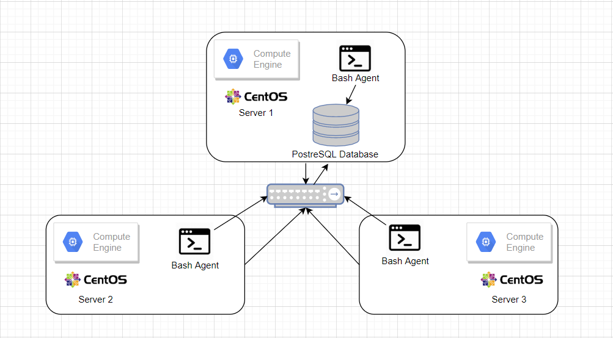

# Linux Cluster Monitoring Agent
## Introduction
Aim of this project is to design and develope a Clustor Monitoring Agent installed in every server that are connected with eachother using a network switch. This tool is used to monitors the host hardware information and host usage (CPU and Memory) and records into PostgreSQL RDBMS database. New data is entered every minute in real time and this data can be later used by Linux Cluster Administration team for the resource planning. In case if usage increases or decreases, team can effectively add/remove computing capacity and storage.

## Design and Architecture


As per above diagram every server connected through a network switch in the cluster would have a bash script that collects the data of individual server and direct it to server 1 where all the data is stored in PSQL database.

## Script Description
* `psql_docker.sh` - The script first of all initiate the Docker if it not running already. User can create a new container if not already built and start or stop the container named `jrvs-psql` with a PostgreSQL image by providing valid username and password.
* `host_info.sh` - The script collects hardware configuration information of individual server in the cluster and then insert the data to the psql table. The following inforamtion is collected and inserted into `host_info` using this script. \
These are also the columns names in the`host_info` table. 
    * id - This primary key is used to uniquly identify each server/node in the cluster.
    * hostname - Hostname of the server.
    * cpu_number - Number of CPUs core in individual server.
    * cpu_architecture - Architecture of the CPU.
    * cpu_model - Model of the CPU.
    * cpu_mhz - Clock speed in MHz.
    * L2cache - Information regarading Level 2 Cache
    * total_mem - Total memory or RAM of the server. Used `/proc/meminfo` command to get this information.
    * timestamp - Current time when the script is excuted `(date "+%F %T")`
* `host_usage.sh` - The script collects individual server's usage data every 1 minute using a `crontab` job and then stores the data into `host_usage` table. \
These are also the columns names in the`host_usage` table. 
    * timestamp - Date and time when the script was executed and collected the information.
    * host_id - This is a foreign key referenced to host_info table by id field
    * memory_free - This variable stores available free memory by MB in individial server.
    * cpu_idle - Time spent idle by CPU in percentage.
    * cpu_kernel - Time spent running kernal code in percentage.
    * disk_io - Blocks send/received from/to device.
    * disk_available - Availability of disk space in server using `$(df -BM /)` command.
* `ddl.sql` - This SQL script creates two tables "host_info" and "host_usage" if they do not already exist.
* `queries.sql` - This script contains the following two SQL queries to better understand the usage statistic and aggeregate of individual server. So a business decision can be made to increace/decrease the resources.
     1) Provides list of all the servers ordered by number of CPU in increasing order and by total memory in decreasing order.
     2) Calculating the average used memory percentage over 5 minutes interval for each host/server.

## Usage

1) Create/Start/Stop docker container \
First create a docker container of PSQL image if not already created by passing PostgreSQL username and password. If container already created one can start or stop it. \
    ```
    # Create a psql docker container "jrvs-psql" with the given postgres username and password.
    ./linux_sql/scripts/psql_docker.sh create postgres password
    # Create database
    
    ## start the stoped psql docker container
    ./scripts/psql_docker.sh start
    
    ## stop the running psql docker container
    ./scripts/psql_docker.sh stop
    ```
2) Create Database and Tables
    ```
    # Create database host_agent
    CREATE DATABASE host_agent;
   
    # Execute ddl.sql script on the host_agent database againse the psql instance
    psql -h localhost -U postgres -d host_agent -f sql/ddl.sql    
    ```
3) `host_info.sh`

    Fetch hardware information data from individual server and store it into `host_info` table of `host_agent` database which resides into `jrvs-psql` container using following command:
    ```
    # Script usage
    ./scripts/host_info.sh psql_host psql_port db_name psql_user psql_password
    ```
4) `host_usage.sh`
   
    Fetch CPU usage information of individual server and store it into `host_usage` table of `host_agent` database which resides into `jrvs-psql` container using following command:
    ```
    # Script usage
    ./scripts/host_usage.sh psql_host psql_port db_name psql_user psql_password
    ```
5) crontab Setup
   
      Setup a crontab job so `host_usage.sh` will execute every minute.
      ```
      # Edit a crontab jobs
      crontab -e
      
      # Write this script  to execute `host_usage.sh` every 1 minute and store log file in tmp folder.
      * * * * * bash [path]/host_usage.sh  "localhost" 5432 "host_agent" "postgres" "password" > /tmp/host_usage.log
      
      # list crontab jobs
      crontab -l
      
      #Verify that the script is running as intended by checking the log file
      cat /tmp/host_usage.log
      ```
## Improvements
1) Create live updating dashboard using tools like Tableau or Power BI for better understand the aggregate of the hardware information and usage data.
2) To run this scripts using a GUI so a Non-Technical person can also work with this tool.
3) Finally deploy this application on actual server rather than localhost.